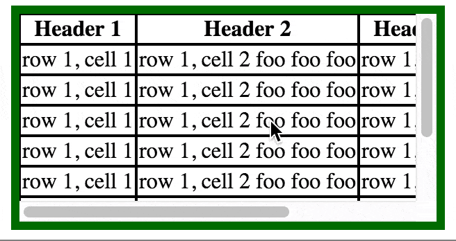

# Sticky Table Header



This works by cloning the thead and positioning it according to the user's scroll position inside a wrapper element.

This library works under some assumptions:
- cells with borders will have `box-sizing: border-box`
- `cellspacing` will be set to 0
- the input table element will have a thead and tbody

The table should be transformed so that:
- thead should stick when scrolling vertically
- thead should not stick when scrolling horizontally
- thead cells should grow/shrink to column contents from tbody

```
npm install
npm run compile
http-server -c-1 ./target
# Once the server is running, see /example.html
```
